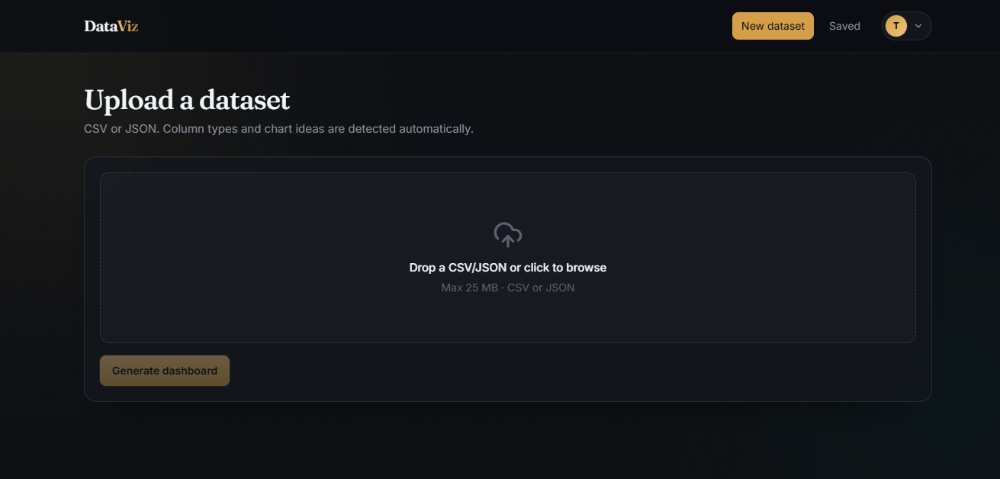
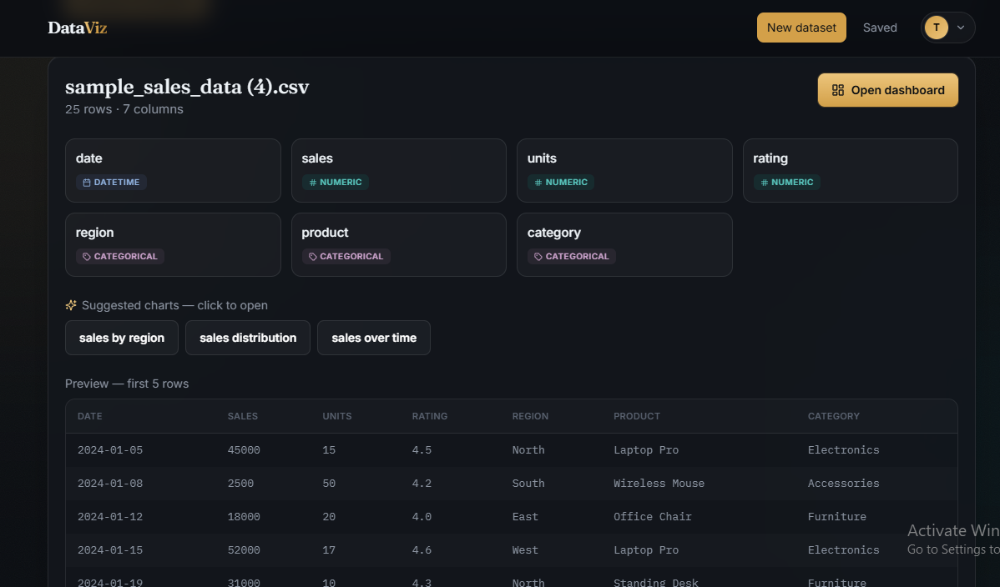
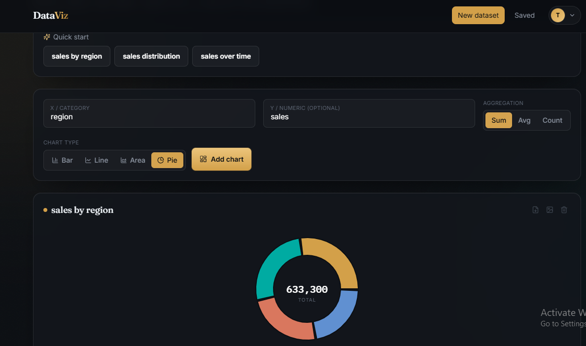
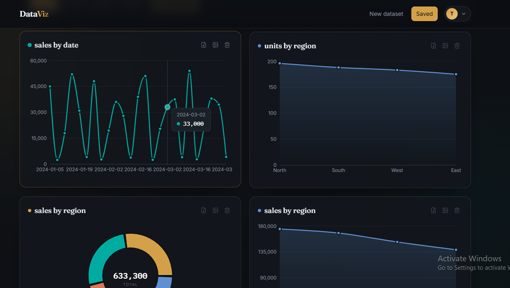
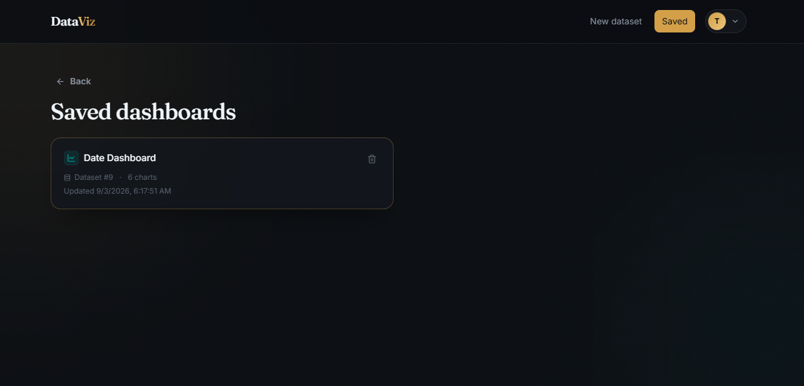
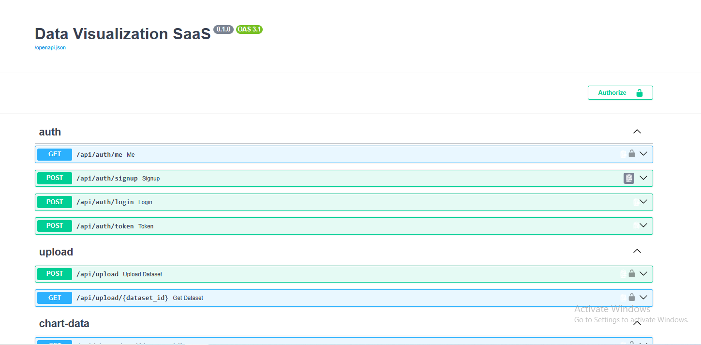
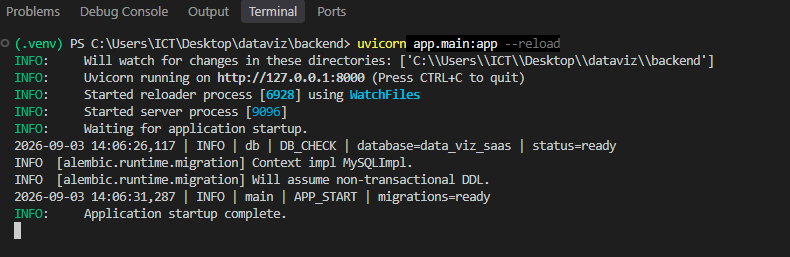

<div align="center">



<br/>
<br/>

# 📊 Data Visualization SaaS

**Upload a CSV or JSON file. Get an interactive dashboard in seconds.**

AI-powered chart suggestions · Saved dashboards · JWT Auth · REST API

<br/>


</div>

---

## ✨ What it does

Upload any **CSV or JSON** file and instantly get:

- 📈 **AI-suggested charts** — bar, line, and pie recommendations based on your columns
- 🎛️ **Interactive dashboard** — pick X/Y axes and render charts on the fly
- 💾 **Saved dashboards** — persist and revisit your work anytime
- 🔐 **JWT authentication** — signup, login, and secure per-user data
- ⚡ **Background processing** — Celery + Redis handles heavy lifting off-request
- 🤖 **Local AI** — Ollama (LLaMA 3.2) for suggestions, with rule-based fallback

---

## 📸 Screenshots

<table>
  <tr>
    <td align="center">
      
      <br/><b>Landing Page</b>
    </td>
    <td align="center">
      
      <br/><b>Login</b>
    </td>
  </tr>
  <tr>
    <td align="center">
      
      <br/><b>Upload & AI Suggestions</b>
    </td>
    <td align="center">
      
      <br/><b>Interactive Dashboard</b>
    </td>
  </tr>
  <tr>
    <td align="center">
      
      <br/><b>Charts View</b>
    </td>
    <td align="center">
      
      <br/><b>Saved Dashboards</b>
    </td>
  </tr>
  <tr>
    <td align="center">
      
      <br/><b>Swagger API Docs</b>
    </td>
    <td align="center">
      
      <br/><b>Console Preview</b>
    </td>
  </tr>
</table>

---

## 🛠️ Tech Stack

### Backend

| | Technology | Version | Role |
|---|---|---|---|
| ⚡ | **FastAPI** | 0.115 | REST API framework |
| 🗄️ | **SQLAlchemy** | 2.0 | ORM |
| 🔄 | **Alembic** | 1.13 | Database migrations |
| 🐬 | **MySQL** | 8 | Primary database |
| 🌿 | **Celery** | 5.4 | Background job queue |
| 🔴 | **Redis** | 5 | Celery message broker |
| 🤖 | **Ollama (LLaMA 3.2)** | — | Local AI chart suggestions |
| 🔑 | **PyJWT + bcrypt** | — | Auth & password hashing |
| 🚀 | **Uvicorn** | 0.30 | ASGI server |

### Frontend

| | Technology | Version | Role |
|---|---|---|---|
| ⚛️ | **React** | 18 | UI framework |
| 🔷 | **TypeScript** | 5.7 | Type safety |
| ⚡ | **Vite** | 6 | Build tool & dev server |
| 🎨 | **Tailwind CSS** | 3.4 | Styling |
| 📊 | **Recharts** | 2.15 | Chart rendering |
| 🎬 | **Framer Motion** | 11 | Animations |
| 🌐 | **Axios** | 1.7 | HTTP client |
| 🔀 | **React Router** | v7 | Client-side routing |
| 🖼️ | **Lucide React** | 0.468 | Icons |

---

## 🏗️ Architecture

```
┌──────────────────────┐          ┌──────────────────────────┐
│   React 18 + Vite    │◄────────►│   FastAPI + Uvicorn      │
│   (Port 5173)        │  HTTP    │   (Port 8000)            │
└──────────────────────┘          └────────┬─────────────────┘
                                           │
                          ┌────────────────┼────────────────┐
                          │                │                │
                    ┌─────▼──────┐  ┌──────▼─────┐  ┌──────▼──────┐
                    │   MySQL    │  │   Redis    │  │   Ollama    │
                    │ (Database) │  │ (Broker)   │  │  (AI / LLM) │
                    └────────────┘  └──────┬─────┘  └─────────────┘
                                           │
                                    ┌──────▼──────┐
                                    │   Celery    │
                                    │  (Worker)   │
                                    └─────────────┘
```

**Request flow:**
1. User uploads CSV/JSON → FastAPI parses columns instantly → returns metadata + AI suggestions
2. Celery worker picks up the task from Redis → processes file in background
3. User selects X/Y axes from suggestions → Recharts renders chart in browser
4. User saves dashboard → stored in MySQL → retrievable anytime

---

## 🚀 Getting Started

### Prerequisites

| Tool | Version | Required |
|------|---------|----------|
| Python | 3.11+ | ✅ |
| Node.js | 18+ | ✅ |
| MySQL | 8+ | ✅ |
| Redis | 5+ | ✅ |
| Ollama | latest | ⚠️ Optional |

> **Note:** If Ollama is not installed, the app automatically falls back to rule-based chart suggestions — everything still works.

---

### 1️⃣ MySQL

Install and start MySQL Server. The backend **automatically creates the database** on first startup — no manual SQL needed.

---

### 2️⃣ Redis

Install Redis and start it on default port `6379`.

---

### 3️⃣ Ollama *(optional)*

```bash
ollama pull llama3.2
```

---

### 4️⃣ Backend

```bash
cd backend

# Create and activate virtual environment
python -m venv .venv

# Windows
.venv\Scripts\activate
# Linux / macOS
source .venv/bin/activate

# Install dependencies
pip install -r requirements.txt

# Setup environment variables
# Windows
copy .env.example .env
# Linux / macOS
cp .env.example .env
```

Open `.env` and fill in your database credentials, then:

```bash
uvicorn app.main:app --reload
```

> ✅ First startup auto-creates the database and runs `alembic upgrade head`.
> 
> 📖 API docs available at **http://localhost:8000/docs**

---

### 5️⃣ Celery Worker

In a **separate terminal** (with venv activated):

```bash
cd backend
celery -A app.workers.celery_app.celery_app worker --loglevel=info
```

---

### 6️⃣ Frontend

```bash
cd frontend
npm install

# Windows
copy .env.example .env
# Linux / macOS
cp .env.example .env

npm run dev
```

Open **http://localhost:5173** in your browser.

---

## 📂 Sample Data

A ready-to-use dataset is included at [`sample-data/sales-sample.csv`](sample-data/sales-sample.csv).

25 rows of product sales across regions and dates — upload it right after signing up to see all chart types in action.

| Column | Type | Triggers |
|--------|------|---------|
| `date` | DateTime | 📈 Line chart |
| `region`, `category`, `product` | Categorical | 📊 Bar & 🥧 Pie chart |
| `sales`, `units`, `rating` | Numeric | Y-axis values |

---

## 📡 API Reference

| Method | Endpoint | Auth | Description |
|--------|----------|------|-------------|
| `POST` | `/api/auth/signup` | ❌ | Register a new user |
| `POST` | `/api/auth/login` | ❌ | Login and receive JWT token |
| `POST` | `/api/upload` | ✅ | Upload CSV/JSON dataset |
| `GET` | `/api/chart-data/{dataset_id}` | ✅ | Fetch chart data (`?x=col&y=col`) |
| `POST` | `/api/dashboards` | ✅ | Save a dashboard |
| `GET` | `/api/dashboards` | ✅ | List all saved dashboards |
| `GET` | `/api/dashboards/{id}` | ✅ | Get a specific dashboard |
| `DELETE` | `/api/dashboards/{id}` | ✅ | Delete a dashboard |
| `GET` | `/health` | ❌ | Health check |

Full interactive docs: **http://localhost:8000/docs**

---

## 🧪 Running Tests

```bash
cd backend
pytest -q
```

---

## 📋 Key Design Decisions

**1. In-request parsing for instant feedback**
Small uploads are parsed synchronously so the API returns column metadata and AI suggestions immediately. Celery handles async processing in the background for scalability.

**2. JSON row storage**
Dataset rows are stored as JSON to keep the chart-data service generic across any file shape. For very large production datasets, a columnar or object-storage architecture would be the next step.

**3. AI with graceful fallback**
Ollama (LLaMA 3.2) runs locally — no external API costs or data leaving your machine. If unavailable, rule-based logic kicks in automatically so the app never breaks.

**4. Per-user data isolation**
All datasets and dashboards are scoped to the authenticated user via JWT. No cross-user data leakage.

---

## 📄 License

[MIT](LICENSE) — free to use, modify, and distribute.
